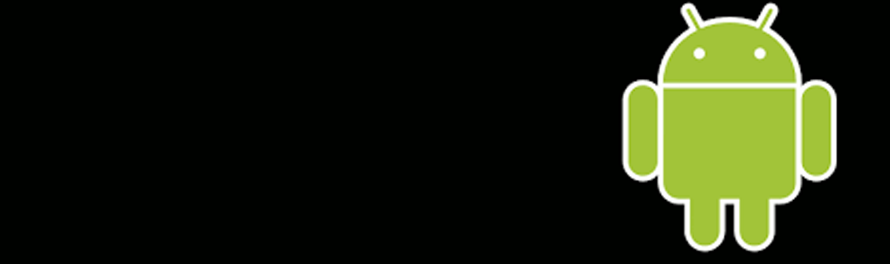

<!-- LICENSE -->

  [![MIT License][license-shield]][license-url]

  
  <!-- Make your project stand out with a banner -->
  

<!-- What is your project about??? -->
# About the repo
In this repository are stored the projects of the subject "Video Games for Mobile Devices" of the Complutense University of Madrid. 

In it, a group of three students got together to develop 2 videogames. The first one is a clone of the game "Oh nO", which was developed in Java using Android Studio and the second one is another clone of the game "Flow Free", written in C# using Unity. 

<!-- Tell the world what are the main technologies/libraries behind this project -->
## Cross-platform "Oh nO" clone 

This game was written in Java, and thanks to the advantages provided by the language, it also serves as an example of cross-platform development, being able to be played on both PC and Android devices.

To achieve this we had to separate the game into three sub-projects:

- **Logic:** This project contains all the code related to the game's logic, from the different submenus through which the player can navigate, to everything related to the gameplay such as: the creation of the game's board, endgame checks... (Logica)

- **Engine:** In order to achieve multiplatform development it is necessary for the game's code to be independent of the platform on which it is running. To do this, it is necessary to prepare a class that provides the game with basic functionalities, such as being able to draw on screen, obtain input from the player, play sounds... This class is represented by "engine", which is an interface from which one child subclass for each platform we are going to deploy on will derive from. Each of these subclasses(PCEngine/AEngine) will take care of dealing with the peculiarities of each platform, allowing us to program the game once, and deploy it on all platforms for which we have an implementation of the "engine" interface.

- **Game's lifecycle:** Since games are not executed in the same way on all platforms, it is necessary to prepare an object for each one, which deals with the game's lifecycle on the platform on which it is being executed (PCGame/AGame). This is especially true in android, where the OS is the one in charge of managing which processes are running and which ones need to be killed at any given moment.

<!-- PROJECT SHIELDS -->
<!--
*** I'm using markdown "reference style" links for readability.
*** Reference links are enclosed in brackets [ ] instead of parentheses ( ).
*** See the bottom of this document for the declaration of the reference variables
*** for contributors-url, forks-url, etc. This is an optional, concise syntax you may use.
*** https://www.markdownguide.org/basic-syntax/#reference-style-links
-->

[![Java][Java.com]][Java-url]
[![AndroidStudio][AndroidStudio.com]][AndroidStudio-url]

  https://github.com/davidczepiel/Mobile-Game-Clones/assets/48888283/a76f1cfb-bc04-4ee1-aaf5-8ff6a97b0792

## "Flow Free" clone 
The purpose of this second game is to compare what it is like to develop projects natively, versus using third party tools that "make development easier", to achieve this, this game is written in C# using the Unity engine. In order to simplify the project, some features of the original game such as the settings screen or the shop have been omitted, resulting in a clone that contains the following:

- A main menu
- A level pack selection screen
- A level selection screen 
- A level playing screen

To add content to the clone, levels were stripped from the original game (these can be found in the "Assets/Data/LevelData/TxtData" folder), most of which are initially locked, and can be unlocked as the player completes them. Finally, to experiment with monetisation in mobile games, use is made of the ads package provided by Unity. This results in the implementation of the following types of ads:

- Banners on every screen in the game
- Interstitial ads each time the player completes a level and proceeds to the next one
- Rewarded ads, when the player presses the rewarded ads button on the level playing screen, which rewards the player with a hint 

[![C#][C#.com]][C#-url]
[![Unity][Unity.com]][Unity-url]

  

https://github.com/davidczepiel/Mobile-Game-Clones/assets/48888283/8cc4b830-f7b6-4ef6-8ce3-730af4d5ecc7

<!-- Let everyone know who made this project possible -->
<h2 align="center">
 Contributors 
</h3>

 
  

<!-- MARKDOWN LINKS & IMAGES -->
<!-- https://www.markdownguide.org/basic-syntax/#reference-style-links -->

[license-shield]: https://img.shields.io/github/license/othneildrew/Best-README-Template.svg?style=for-the-badge
[license-url]: https://github.com/othneildrew/Best-README-Template/blob/master/LICENSE.txt
[linkedin-shield]: https://img.shields.io/badge/-LinkedIn-black.svg?style=for-the-badge&logo=linkedin&colorB=555

[C#.com]: https://img.shields.io/badge/c%23-%23239120.svg?style=for-the-badge&logo=c-sharp&logoColor=white
[C#-url]: https://learn.microsoft.com/en-us/dotnet/csharp/

[Unity.com]: https://img.shields.io/badge/unity-%23000000.svg?style=for-the-badge&logo=unity&logoColor=white
[Unity-url]: https://learn.microsoft.com/en-us/dotnet/csharp/

[Java.com]: https://img.shields.io/badge/java-%23ED8B00.svg?style=for-the-badge&logo=openjdk&logoColor=white
[Java-url]: https://www.java.com/en/

[AndroidStudio.com]: https://img.shields.io/badge/Android%20Studio-3DDC84.svg?style=for-the-badge&logo=android-studio&logoColor=white
[AndroidStudio-url]: https://developer.android.com/studio/intro?hl=en
